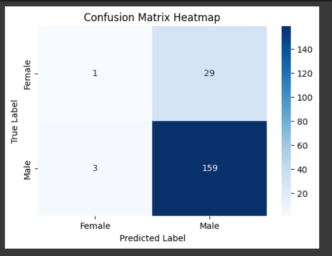
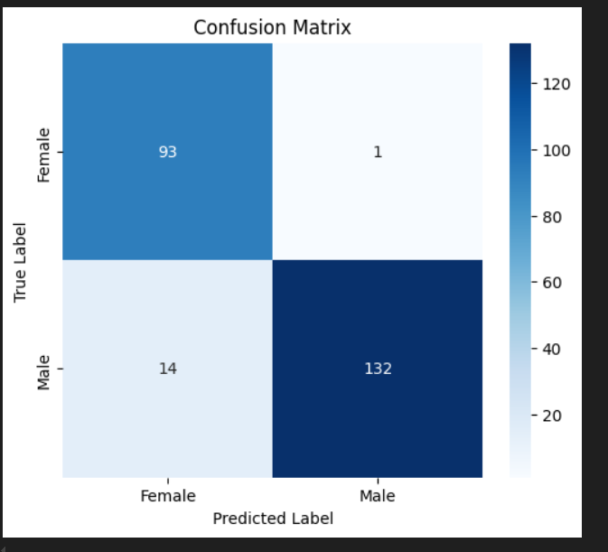
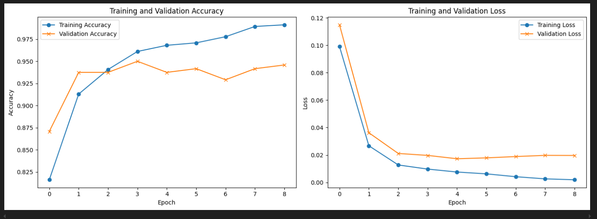

# 🧠 Hackathon_Comys Project

This repository contains our submission for the Hackathon. Below are the model outputs, visualizations, and relevant screenshots stored in the `pics/` folder.

---

## 📸 Sample Predictions

### 1. Gender Classification Output

#### 🔹 Baseline Model: Basic CNN
The initial model used a simple CNN architecture without addressing class imbalance. As shown below, it performed poorly on female samples due to the imbalanced dataset.



#### 🔹 Improvements with Oversampling & Focal Loss
To address the imbalance and improve minority class (female) performance, the following techniques were applied:

- **Transfer Learning**: We used pre-trained convolutional backbones (ResNet50, EfficientNetV2, and ConvNeXt) to leverage learned feature representations and improve generalization on our dataset.
- **Oversampling**: Balanced the dataset by oversampling female samples to ensure sufficient representation during training.
- **Focal Loss**: Replaced standard cross-entropy loss with focal loss to focus the model on harder-to-classify samples.  
  - Tuned hyperparameters:  
    - Alpha = 0.89  
    - Gamma = 1.3

These changes significantly improved female accuracy and overall model robustness.

**Models Used:** ResNet50, EfficientNetV2, ConvNeXt (transfer learning).

#### 🔹 Final Model Results
After applying these methods and fine-tuning, the final model achieved high accuracy on both classes.  

**Final Confusion Matrix and Accuracy Plot:**





**Classification Report:**

| Metric       | Female | Male |
|---------------|---------|------|
| Precision     | 0.87  | 0.99 |
| Recall        | 0.99  | 0.90 |
| F1-score      | 0.93  | 0.95 |
| Support       | 94    | 146 |

- **Overall Accuracy**: 0.94 (on 240 samples)
- **Macro Average Precision**: 0.93
- **Macro Average Recall**: 0.95
- **Macro Average F1-score**: 0.94
- **Weighted Average Precision**: 0.94
- **Weighted Average Recall**: 0.94
- **Weighted Average F1-score**: 0.94

**Summary Metrics:**

- ✅ F1 Score: **0.9462**
- ✅ Precision: **0.9925**
- ✅ Recall: **0.9041**

## Install the required packages

1. Download required packages.

    ```bash
    pip install -r requirements.txt
    ```

2. In `testing.py`, **provide the test data path as a command line argument** when running the script. For example:

```bash
python testing.py /path/to/test_dataset


